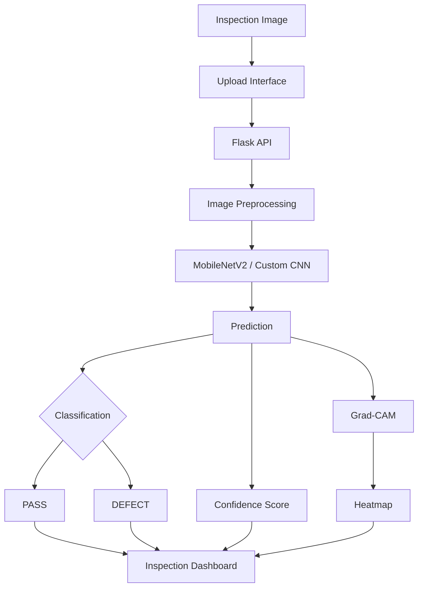

# <p align="center">🔬 VisionSpec QC</p>

<p align="center">
  <strong>AI-Powered Visual Quality Control & Defect Intelligence</strong>
</p>

<p align="center">
  <em>From raw inspection images to explainable defect decisions — powered by deep learning and computer vision.</em>
</p>

<p align="center">


</p>

---

<p align="center">

🌸 **Inspect visually. Detect intelligently. Explain clearly.** 🌸

</p>

---

## 🤎 What is VisionSpec QC?

**VisionSpec QC** is an AI-driven computer vision platform designed for automated visual quality inspection.

The system takes an inspection image, preprocesses it into a model-ready representation, performs binary classification into:

- `DEFECT`
- `PASS`

and can additionally generate a **Grad-CAM visual explanation** showing the image regions that contributed most strongly to the model's decision.

The project brings together:

> **Deep Learning + Computer Vision + Explainable AI + REST APIs + Interactive Visualization**

into a single inspection workflow.

---

## ✨ Why VisionSpec?

Traditional visual inspection can depend heavily on manual observation and repetitive screening.

VisionSpec QC explores how AI-assisted inspection can transform that workflow into a structured pipeline:

```text
Inspection Image
       ↓
Preprocessing
       ↓
Image Normalization
       ↓
Deep Learning Model
       ↓
DEFECT / PASS
       ↓
Confidence Score
       ↓
Grad-CAM Explainability
       ↓
Inspection Dashboard
````

The result is not just a classification label, but a more interpretable inspection experience.

---

# 🌸 Core Capabilities

## 👁️ 1. AI Visual Inspection

VisionSpec processes uploaded images and classifies them into two inspection outcomes:

| Prediction | Meaning                          |
| ---------- | -------------------------------- |
| `DEFECT`   | Potential visual defect detected |
| `PASS`     | Image classified as passing      |

The inference pipeline works on images resized to:

```text
224 × 224 × 3
```

with pixel values normalized to the `[0, 1]` range.

---

## 🧠 2. Dual-Model Learning Pipeline

The repository implements two classification approaches.

### Custom CNN

A convolutional neural network developed from scratch using:

```text
Conv2D
↓
Batch Normalization
↓
ReLU
↓
Max Pooling
↓
Dropout
↓
Global Average Pooling
↓
Dense Layers
↓
Sigmoid Output
```

The architecture uses multiple convolutional blocks with progressively increasing feature channels.

---

### MobileNetV2 Transfer Learning

The primary high-efficiency architecture uses:

**MobileNetV2 pretrained on ImageNet**

followed by a custom binary classification head:

```text
Input Image
    ↓
MobileNetV2 Backbone
    ↓
Global Average Pooling
    ↓
Dense 256
    ↓
Dropout
    ↓
Dense 128
    ↓
Dropout
    ↓
Sigmoid
    ↓
DEFECT / PASS
```

This provides an efficient starting point for visual feature extraction while keeping the classification head tailored to the inspection problem.

---

# 🌷 Explainable AI with Grad-CAM

A major component of VisionSpec QC is **Grad-CAM (Gradient-weighted Class Activation Mapping)**.

Instead of returning only:

```text
DEFECT — 94.7%
```

the platform can also generate a heatmap indicating the regions of the image that contributed to the prediction.

### Explainability workflow

```text
Input Image
     ↓
Model Prediction
     ↓
Gradient Computation
     ↓
Activation Weighting
     ↓
Class Activation Map
     ↓
Heatmap Overlay
```

This makes the inspection pipeline more transparent and useful for model analysis.

The API can return:

* prediction label
* confidence
* raw probability
* Grad-CAM heatmap
* comparison visualization
* timestamp

---

# 💎 Interactive Inspection Interface

VisionSpec QC includes a dedicated browser interface with a **glassmorphic visual design**.

The interface provides:

### 📤 Specimen Upload

Upload inspection images through the UI using:

* drag & drop
* file selection

Supported image formats include:

```text
JPG
JPEG
PNG
BMP
TIFF
WEBP
```

---

### 🔍 Defect Analysis

The inspection workflow displays:

```text
┌───────────────────────────────┐
│        ANALYSIS RESULT        │
├───────────────────────────────┤
│                               │
│       ✓ PASS / ⚠ DEFECT       │
│                               │
│       Confidence Score        │
│       ████████████░░ 94.7%    │
│                               │
│       Latency                 │
│       Model                   │
│       Timestamp               │
│                               │
└───────────────────────────────┘
```

---

### 🌡️ Visual Heatmap

After inference, the UI can render the Grad-CAM analysis so the model's visual attention can be inspected alongside the original specimen.

---

### 📋 Inspection History

The interface maintains a session-level inspection history containing:

* specimen preview
* prediction
* confidence
* latency

allowing multiple inspections to be visually tracked.

---

# 🧪 Dataset Pipeline

VisionSpec contains an automated preprocessing pipeline for preparing the image dataset.

### Original classes

```text
Positive/
Negative/
```

are mapped to:

```text
Positive → DEFECT
Negative → PASS
```

---

## 📊 Dataset Splitting

The preprocessing module creates:

```text
Train → 70%
Validation → 15%
Test → 15%
```

with reproducibility controlled using:

```text
SEED = 42
```

Generated structure:

```text
data/
├── raw/
│   ├── Positive/
│   └── Negative/
│
└── splits/
    ├── train/
    │   ├── DEFECT/
    │   └── PASS/
    │
    ├── val/
    │   ├── DEFECT/
    │   └── PASS/
    │
    └── test/
        ├── DEFECT/
        └── PASS/
```

---

# 🌼 Image Augmentation

Training images can pass through augmentation operations including:

* rotation
* zoom
* brightness variation
* horizontal flipping
* nearest-neighbour filling

while validation and test images use normalization without training augmentation.

This creates a more robust training workflow while preserving clean evaluation inputs.

---

# 🔬 Exploratory Data Analysis

The repository includes an EDA module for examining the dataset before training.

Run:

```bash
python notebooks/01_eda.py
```

The workflow generates visualizations including:

```text
notebooks/
├── class_distribution.png
├── sample_grid.png
└── pixel_distribution.png
```

### EDA views

**Class Distribution**

Shows the number of images in the `PASS` and `DEFECT` categories.

**Sample Grid**

Displays representative images from both classes.

**Pixel Intensity Distribution**

Visualizes grayscale pixel distributions across inspection images.

---

# ⚙️ Training Configuration

The main training pipeline uses:

```text
Image Size      : 224 × 224
Batch Size      : 32
Epochs          : 30
Seed            : 42
Optimizer       : Adam
Loss            : Binary Cross-Entropy
```

Evaluation includes:

* Accuracy
* Precision
* Recall
* F1 Score
* Confusion Matrix
* Classification Report

The training pipeline also supports:

```text
Early Stopping
Model Checkpointing
Learning-Rate Reduction
TensorBoard Logging
```

---

# 📈 Model Monitoring

Training logs are written into the:

```text
logs/
```

directory.

TensorBoard can be launched with:

```bash
tensorboard --logdir logs/
```

This enables inspection of training behaviour across experiments.

---

# 🌐 REST API

VisionSpec QC exposes a Flask-based inference API.

## `GET /`

Serves the frontend inspection application.

---

## `GET /health`

Returns a lightweight service health response.

Example:

```json
{
  "status": "ok",
  "timestamp": "..."
}
```

---

## `POST /predict`

Runs a complete inspection.

### Request

```text
multipart/form-data
image=<inspection image>
```

### Response

```json
{
  "label": "DEFECT",
  "confidence": 94.7,
  "raw_prob": 0.947,
  "heatmap_b64": "<base64 PNG>",
  "comparison_b64": "<base64 PNG>",
  "timestamp": "..."
}
```

---

## `POST /heatmap`

Generates a Grad-CAM visualization and returns it as a PNG image.

---

## `POST /stream_predict`

Accepts multiple images for batch-style inspection.

The implementation supports up to **5 images per request**.

---

# 🪄 Smart Demo Mode

The frontend also contains a fallback demonstration mode.

When the Flask API is unavailable, the interface can generate simulated responses so the UI workflow can still be explored.

This mode is intended for:

```text
UI demonstrations
Prototyping
Presentation workflows
Offline interface testing
```

It should not be interpreted as real model inference.

---

# 🏗️ System Architecture



---

# 🗂️ Repository Structure

```text
visionspec-qc/
│
├── app.py
├── demo_guide.py
├── demo_script.py
├── quick_test.py
├── requirements.txt
├── Procfile
├── render.yaml
├── vercel.json
│
├── frontend/
│   ├── index.html
│   └── config.js
│
├── src/
│   ├── preprocessing.py
│   ├── train.py
│   ├── predict.py
│   └── gradcam.py
│
├── notebooks/
│   └── 01_eda.py
│
├── data/
│   ├── raw/
│   ├── splits/
│   └── uploads/
│
├── models/
│
└── logs/
```

---

# 🚀 Getting Started

## 1. Clone the repository

```bash
git clone https://github.com/ViivianREINE/visionspec-qc.git
cd visionspec-qc
```

---

## 2. Install dependencies

```bash
pip install -r requirements.txt
```

For RAR-based dataset extraction, the project also uses:

```bash
pip install rarfile patool
```

A suitable system archive utility such as `unrar` may also be required depending on the environment.

---

# 📦 Prepare the Dataset

Place the raw dataset inside:

```text
data/raw/
```

with the class structure:

```text
data/raw/
├── Positive/
└── Negative/
```

The preprocessing pipeline can then construct the training, validation and test splits.

Example:

```bash
python src/preprocessing.py \
  --rar "path/to/dataset.rar" \
  --raw data/raw
```

---

# 🧠 Train the Model

### MobileNetV2

```bash
python src/train.py --model mobilenet
```

### Custom CNN

```bash
python src/train.py --model cnn
```

### Train both

```bash
python src/train.py --model both
```

The trained models are written into:

```text
models/
```

---

# 🔍 Run Inference from CLI

### Single Image

```bash
python src/predict.py \
  --model models/mobilenet_final.keras \
  --image sample.jpg \
  --heatmap
```

### Batch Prediction

```bash
python src/predict.py \
  --model models/mobilenet_final.keras \
  --dir data/splits/test/DEFECT \
  --output results.json
```

---

# 🌡️ Generate Grad-CAM

```bash
python src/gradcam.py \
  --model models/mobilenet_final.keras \
  --image sample.jpg \
  --output notebooks/gradcam_out.png
```

---

# 🖥️ Run the Application

Start the Flask server:

```bash
python app.py
```

Then open:

```text
http://localhost:5000
```

The frontend is served directly by the Flask application.

---

# 🧪 Test the API

A lightweight diagnostic script is included:

```bash
python quick_test.py
```

The repository also includes:

```bash
python demo_script.py
```

for a more complete inspection demonstration workflow.

---

# ☁️ Deployment

The repository includes deployment configuration for hosted execution.

### Render

The included `render.yaml` defines a Python web service using:

```bash
pip install -r requirements.txt
```

and:

```bash
python app.py
```

with:

```text
/health
```

used as the health-check endpoint.

### Vercel

A frontend deployment configuration is also included through:

```text
vercel.json
```

and:

```text
frontend/config.js
```

The production API URL can be configured there for a separately deployed Flask backend.

---

# 🧰 Technology Stack

| Layer                   | Technologies                  |
| ----------------------- | ----------------------------- |
| **Language**            | Python                        |
| **Deep Learning**       | TensorFlow, Keras             |
| **Primary Model**       | MobileNetV2                   |
| **Alternative Model**   | Custom CNN                    |
| **Explainability**      | Grad-CAM                      |
| **Computer Vision**     | OpenCV                        |
| **Image Processing**    | Pillow                        |
| **Backend**             | Flask, Flask-CORS             |
| **Frontend**            | HTML, CSS, JavaScript         |
| **Visualization**       | Matplotlib, Seaborn           |
| **ML Evaluation**       | Scikit-learn                  |
| **Experiment Tracking** | TensorBoard                   |
| **Deployment**          | Render / Vercel configuration |

---

# 🌸 Engineering Highlights

### ♡ Modular ML Architecture

The repository separates:

```text
Preprocessing
Training
Inference
Explainability
API Serving
Frontend
```

into dedicated components.

### ♡ Reproducible Experiments

A fixed seed is used across the preprocessing and training pipeline.

### ♡ Explainable Predictions

Grad-CAM gives the system an interpretability layer instead of treating classification as a pure black box.

### ♡ Multiple Inference Interfaces

VisionSpec supports:

```text
Web UI
REST API
CLI inference
Batch inference
Demo utilities
```

### ♡ Deployment-Aware Design

Render and Vercel configuration is included directly in the repository.

---

# ⚠️ Important Notes

VisionSpec QC is an AI-assisted inspection prototype and research/engineering project.

The repository's documented model performance values should be treated as experiment-specific expectations rather than universal guarantees across unseen industrial environments.

Real-world deployment would require additional validation across:

* representative production imagery
* lighting variation
* camera variation
* defect morphology
* acquisition conditions
* false-positive / false-negative costs
* domain-specific quality-control requirements

The frontend's offline demo mode produces simulated responses and is not equivalent to trained-model inference.

---

# 🌱 Future Directions

Potential extensions include:

```text
• Multi-class defect categorization
• Object detection and localization
• Instance-level defect segmentation
• Automated inspection reports
• Active learning workflows
• Production camera integration
• Model drift monitoring
• Human-in-the-loop review
• Edge deployment optimization
• Inspection analytics dashboards
```

---

# 💗 Project Philosophy

> **A good inspection system should not only say what it sees — it should help you understand why.**

VisionSpec QC combines automated visual classification with explainability so that every inspection can become part of a more transparent and measurable quality-control workflow.

---

# 🌷 Built With

```text
Python
TensorFlow
Keras
MobileNetV2
OpenCV
Flask
Grad-CAM
Scikit-learn
HTML / CSS / JavaScript
```

---

<p align="center">

### 🌸 VisionSpec QC

<em>See the defect. Understand the signal. Make inspection smarter.</em>

<br><br>

**Built with ♡ for AI-powered visual quality intelligence.**

</p>
```

---

